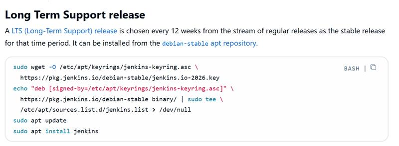
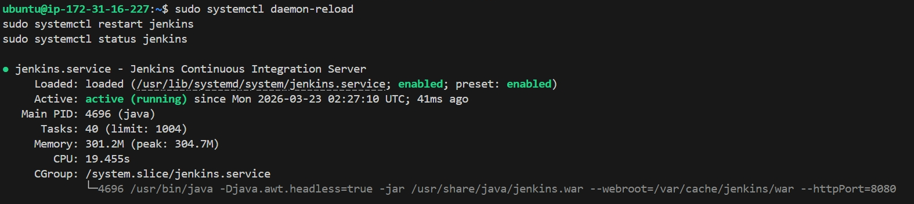
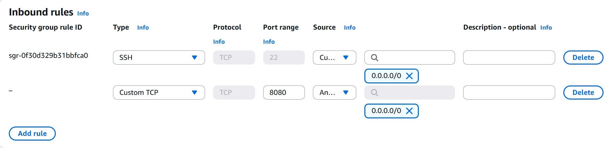
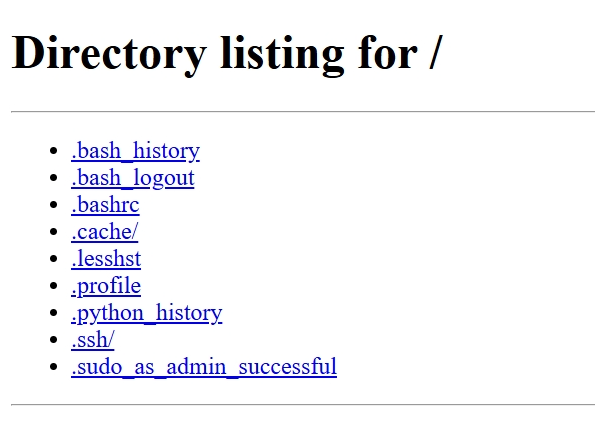
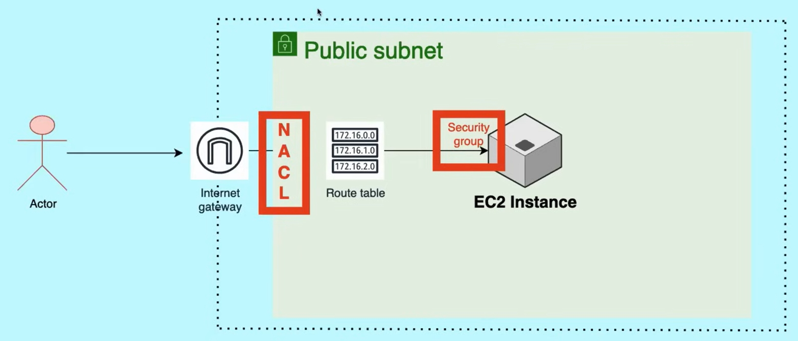

# AWS Basic Concepts Part1
AWS: Amazon Web Services  
Basic concepts Part I  
Include: IAM, EC2, S3, VPC, Route 53
- **IAM**  
  
  Concepts:  
  Authentication (认证 like whether this user has the right to login)  
  Authorization (授权 like what this user can do, e.g., delete / create / modity after login)  
  Root user could use IAM service to authorize other users rights (like read, delete, etc.)
  - 4 Components of IAM service:  
  **Users**  
  **Groups**: A collection of users  
  **Policies**: A set of permissions  
  **Roles**: A way to grant permissions to services, (temporary ID card，相比于长期有效的user，roles是短期临时权限)
  - Detailed explanation:  
  **IAM users**: IAM users have permanent long-term credentials, such as a username and password, or access keys (Access Key ID and Secret Access Key). IAM users can be assigned directly to IAM policies or added to IAM groups for easier management of permissions.  

  **IAM roles**: Not associated with a specific individual. Instead, it is assumed by entities such as IAM users, applications, or services to obtain temporary security credentials. IAM roles are useful when you want to grant permissions to entities that are external to your AWS account or when you want to delegate access to AWS resources across accounts.  

  **IAM groups**: An IAM group is a collection of IAM users. By organizing IAM users into groups, you can manage permissions collectively. Users within an IAM group inherit the permissions assigned to that group.  

  **IAM policy**: An IAM policy is a document that defines permissions and access controls in AWS. IAM policies can be attached to IAM users, IAM roles, and IAM groups to define what actions can be performed on which AWS resources. IAM policies use JSON (JavaScript Object Notation) syntax to specify the permissions and can be created and managed independently of the users, roles, or groups.

- **EC2**  
  Concepts: Elastic compute cloud: AWS would provide a virtual server, including CPU, disk, RAM, which you could scale up or down resources based on your project need.  

  **ATTENTION: EC2 itself doesn’t belong to public or private, it only depends on which subnet you put it in.**  
  
  **Multiple EC2 instances types**:  
  General EC2  
  Compute optimized (higher CPU performance)  
  Memory optimized (内存优化，快速处理内存数据)  
  Storage optimized （存储优化，快速读写本地海量数据）  
  Accelerated computing (With extra computing resources, like GPU, FPGA, suited for ML and AI)  
  
  **Address types**:
  - Public address: use it access EC2 from outside. Lost after restarting the EC2 instance and a new public address will be allocated.  
  - Private address: Never change. Allow EC2 instances in the same VPC to communicate. Never accessible on public internet.  
  
  **How to connect to EC2 instance?**  
  1. Mac/Linux:  
   - Save the .pem file to your local machine.  
   - Optional: chmod 700 your-key-pair.pem (If the next step fails, you can try this step)  
   - ssh -i "your-key-pair.pem" ubuntu@your-ec2-public-address (ubuntu for ubunru Ec2 instance, username may vary based on your instance type)  
  2. Windows:  
   - Install MobaXTerm  
   - Open MobaXTerm, go to Setting -> SSH -> Enter host + address -> Click Advanced ssh setting -> Select your key pair -> Click OK 
  3. Self-check after connection:  
   - whoami  
   - sudo apt update  
  
  **Toy Example: Jenkins**  
  1. **Install Java**:  
   - sudo apt install openidk-11-jdk  
   - java --version
  2. **Install Jenkins**:
   - Go to this page(https://www.jenkins.io/doc/book/installing/linux/) and paste the command to your terminal:  
     
   3. **If error**:  
  If java version doesn't match with the installed jenkins:  
  sudo apt install openjdk-21-jdk -y  
  sudo update-alternatives --config java  
  java --version  
  4. **Start Jenkins**:  
  sudo systemctl daemon-reload  
  sudo systemctl restart jenkins  
  sudo systemctl status jenkins
    
  Now the EC2 server is ready to use Jenkins.  
  5. **Set up inbound security group on Ec2**  
   Add inbound rule to allow TCP + port 8080 on your EC2 instance.  
     
   6. **Access Jenkins**:  
   On your broswer, type: http://your-ec2-public-ip:8080  
   A jenkins login page will show up. On your EC2 terminal, enter:  
   sudo cat /var/lib/jenkins/secrets/initialAdminPassword
   Use the password to login Jenkins.
   7. **Logout EC2**:  
   logout
   8. **Another Python Example**  
   On your EC2 terminal, run:  
   **python3 -m http.server**, (port 8000 will be opened and wait for any potential traffic coming in).  
   Then add inbound rules in SG: allow traffic using port 8000 to pass through.  
   Open in your browser: http://public-address:8000. You can your ubuntu machine's folder structure.
   
   
- **S3**  
  
   Concept: Simple Storage Service to store data.  
   Advantages:
   1. Scalable: You can store as much data as you want. S3 will manage it automatically. The more you store, the higher it costs.  Choose multiplart uploads if 1 single file is very huge. One single file shouldn't be larger than 5TB.  
   2. Highly available: S3 will make many duplications of your data, so even if 1 AZ goes down, you can still access your data.  
   3. Secure (11-9 policy: only 1 object of 1billion objects after 100 years' storage may get lost). All files you upload could be encrypted.  
   4. Cost effective. Standard storage class only takes 0.02 dollars for 1GB per month. The better storage class, the more it costs.  

   Namespace  
   Global: 全球范围内不能用重名bucket  
   Regional: 特定区域内不能有重名bucket, advantage: less latency
   
   Bucket: This is where you put your information.  
   
   S3 also has version control system, you can turn on the Version button, then S3 would record every version of the uploaded files with exactly the same names.
   
   
- **VPC**  
  
  Concept: Virtual Private Cloud  

  VPC is a secure, private, virtual network you created in the cloud. Completely isolated from others' network.  

  Every time you create a new AWS account, AWS would create a default VPC for you. 
  Then all EC2 instances you create will be put in this VPC automatically, which means they could communicate with each other by private IP address without any charges. 
  If you don't want to put EC2 in the default VPC (like you want a total isolation between your test environment and production environment), you have to create a new VPC and set it up.  

  **VPC size**:  
  Decided by ip address range:  
  Example: 10.1.0.0/16: 256 * 256 available ip address  
  /16: the first 16 digits are fixed, only the last 16 digits could be modified.  

  **Components**:  
  - Subnets:  isolated sub-network in VPC. Defined by ip range. Public subnet could reach internet, private subnet is for internal only.  
  - Internet gateway: connect VPC to internet.  
  - Route table: Tell coming packets where to go.  
  - Security group: Control incoming and outgoing traffic.  
  - Load balancer: balance incoming traffic to different servers.
  
  **Complete processof a request from outside internet to the EC2 instance inside the VPC**:  
  Request passes through the Internet gateway  
  -> meets the public subnet, and load balancer (in public subnet)  
  -> load balancer creates a Target group using the private subnet  
  -> the traffic flows to the target group following the route table  
  -> security groups decide whether the request could enter or not

  **How does private subnet communicate with internet?**  
  By using NAT gateway.  
  NAT gateway (also created in public subnet):  
  Only allows traffic flowing from private subnet to the outside, no outside message is allowed to enter.  

  Example usage: when EC2 in private subset needs to download some resources from internet, to ensure its security,
  use NAT gateway to mask the request sent by private subnet. Then internet could only capture data from the NAT gateway,
  but no access to the private subnet directly.  

  **How to connect to EC2 instances in private subnet?**  
  Bastion host / Jumper host(跳板机):  
  Since Ec2 instances are always in private subnet, and no internet/SSH could login the servers, how to maintain these EC2 instances?  
  Crate a bastion host in public subnet, and user could connect to bastion host (only allows certain IP address to SSH login) first, then connect to EC2 (now they are in a secure network environment, could use SSH / RDP to connect).  
  部署流程：
  Public Subnet (公有子网)： 部署一台最小规格的 EC2（比如 t3.micro），赋予它 Public IP。这就是 Bastion Host.  
  Private Subnet (私有子网)： 部署业务 EC2（通过 ASG 管理）。它们没有 Public IP，只有 Private IP.  
  安全组 (Security Groups) 设置：  
  Bastion SG： 只允许家庭/公司固定 IP 通过 22 端口访问。  
  Private EC2 SG： 只允许来自 Bastion SG 的 ID 的 22 端口流量。

  **Security Group**:  
   **Instance level security** (default no outside traffic could reach instances. i.e. cannot reach http://public-address:8080 unless you open the port 8080 in the inbound rules of security groups)  
   ▫ Inbound traffic: traffic flowing into your EC2 is called inbound traffic  
   ▫ Outbound traffic: traffic flowing out from your EC2 to outside internet is called outbound traffic.  
   Default SG: allows all outbound traffic, but no inbound traffic could enter.  

   **NACL**: Network Access Control List  
   **Subnet level security**  
       ▫ Default: allows all traffic going in and out, can be either be deployed on public subnet or private subnet  
       ▫ Could define allowed traffic and denied traffic  
       ▫ 入站规则和出站规则需要同时定义，否则流量入站之后，无法出站  
       ▫ Save time: no need to deploy SG for every EC2 in the subnet, just deploy NACL for this subnet  
       ▫ Rule number: 从小到大匹配，一旦匹配上就直接执行操作(allow / deny)，如果一直没匹配上，会顺延使用最后一条默认规则(*) 丢弃数据

  

- **Route 53**  
  Provide DNS services: maps the domain name with the ip address.  
  ▫ You can buy and register domain name in Route53.  
  ▫ Resolve domain names.  
  After sending requests (i.e. request amazon.com) enter the internet gateway, it reaches Route53, then Route53 finds out the corresponding ip address.  
  ▫ Health check: direct traffic to active working servers.  

- **Auto Scaling Group**  
  自动扩容/缩容策略，i.e. when CPU utilization rate > 70%, ASG would automatically add more machines. When CPU rate < 30%, it will reduce machines.  
  Parameter: Amount of desired machines, Max machines, Min machines.  
  Self-healing: If one machines doesn't work, ASG will restart a new one with the exactly same configuration as the broken machine.  
  Usually working with Application Load Balancer (ALB).

  
  
