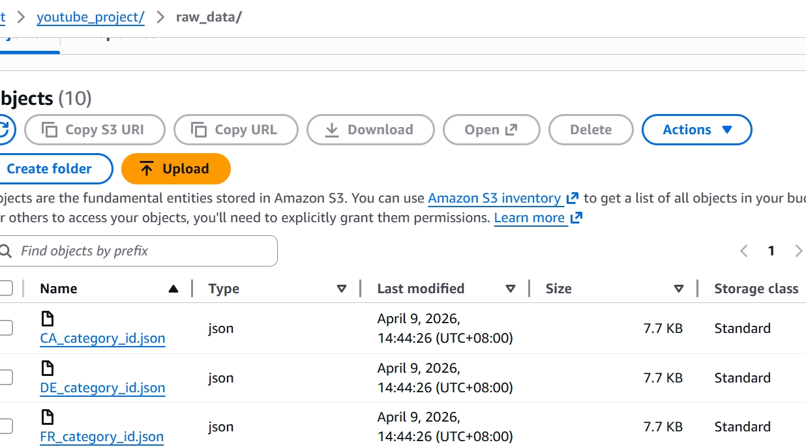
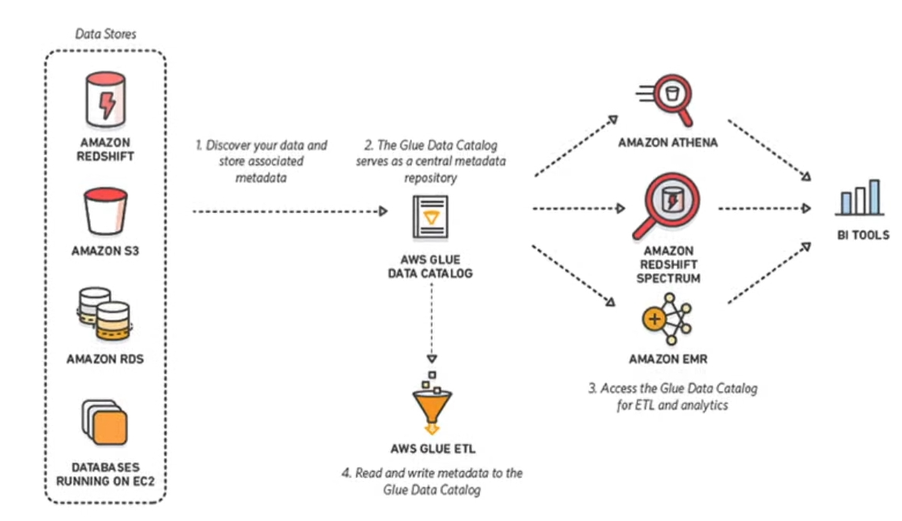
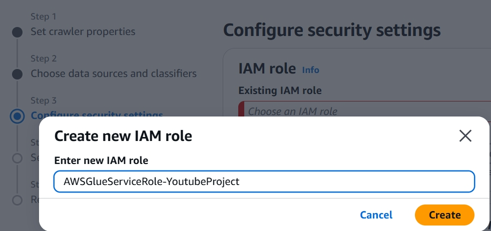
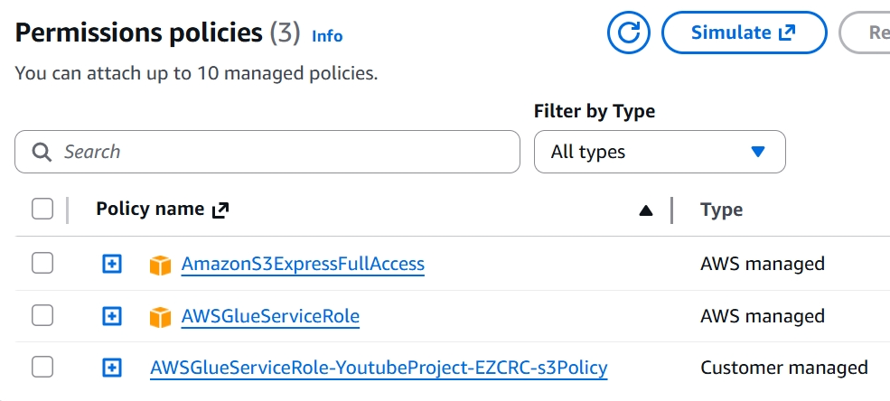
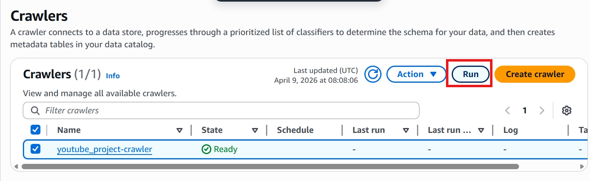
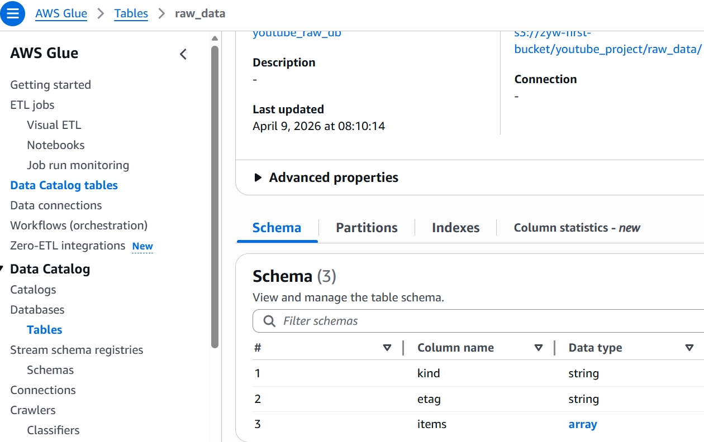
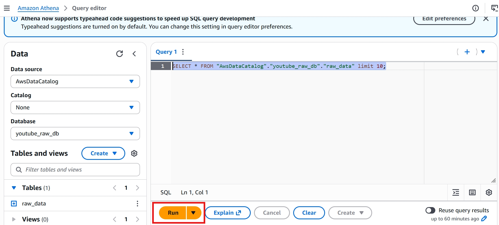

# AWS Basic Concepts Part2  

Basic concepts Part 2  
Include: CLI, 

- **CLI**  
  Run AWS services (such as launch S3 bucket, upload files, etc) by commands  
  Basic command type:  
  aws \<service\> \<operation\> \<parameters\>  

  • Install AWS CLI  
  Official AWS website: https://docs.aws.amazon.com/cli/latest/userguide/getting-started-install.html   
  Windows: install by msi  
  Mac: install by cmd  
  Self-check: **aws --version**  
  Example output: aws-cli/2.34.26 Python/3.14.3 Windows/11 exe/AMD64  

  • Configure AWS CLI  
    Match your AWS account with your local AWS CLI:  
    **aws configure**  
    
    Access key id and key:  
    Go to your AWS console account ->  
    user security credentials ->  
    Create new access keys (In industry, you'd better login and create keys as IAM users instead of root users)  
    Default region (example): us-east-1  
    Default format (example): json  

    Self-check:  
    **aws s3 ls**: It will output your S3 buckets information.  

    CLI reference book: https://docs.aws.amazon.com/cli/latest/  

    Upload data to S3 by AWS CLI:  
    1. cd your-data-folder  
    2. **aws s3 cp . s3://your-bucket-name/folder1/sub-folder/ --recursive --exclude "\*" --include "\*.json"**  
   
    > Explanation:  
      cp . : copy files in the current folder to the target bucket  
      your-bucket-name/folder1/subfolder/: target bucket, automatically create folders if they don't exist  
      --recursive: copy all files (MUST when multiple files are in the current folder)  
      --exclude: upload nothing (usually works together with include)  
      --include: only upload specified files  

      

     Upload single file:  
     aws s3 cp your-single-file s3://your-bucket-name/single-file-folder/

    3. Sync command to upload files:  
    **aws s3 sync . s3://zyw-first-bucket/youtube_project/raw_data/ --exclude "\*" --include "\*.json"**  

    sync: automatically check differences between your local folder and your S3 bucket, and only upload/delete/modify changes.  
    
    Attention: if you delete some local files, files in S3 bucket will also be deleted when using sync.  

- **GLUE**  
  Definition: Fully managed ETL (Extraction, Transformation, Load) services by AWS.  

  2 main features: 
  Data catalog + Spark ETL engine
    
  Data catalog: stores metadata of your data. It means a centralized data catalog of your stored data, such as where your data is stored? which columns does it have? how does its schema look like?
    
  ETL engine: you can visually create, run and monitor ETL pipelines by GLUE.  

    

    Hands-on:
    After uploading data to S3, go to Glue:
    1. Create crawler and choose your S3 as its data store.
    2. Add IAM role for this crawler service, because as a service, GLUE itself does not have access to the S3 service.  
      

    3. Add S3 full access permission to this role.  
      

    4. Add database and run crawler.  
      

    5. After crawling finished, a data catalog table will be created, check Data Catalog -> Databases -> Tables.  
      

    Use AWS Athena to query data:  
    Click "View data", and go to Athena.  
    Before querying data, create a bucket to store query results first.

    
  
  
