# VPC Project

This project is going to set up a VPC which has 2 availability zones, each with 1 public subnet and 1 private subnet (that would be 4 subnet in total). The VPC will also have a bastion host, a NAT gateway, and a load balancer. ASG will be used to automatically launch EC2 instances in the private subnets.  The EC2 instance in the first private subnet will be a web which is reachable from your browser. The EC2 instance in the second private will be set up with nothing, and its SG will not be open. In the final test, you should only be able to access 1 web and unreachable to another.  

The whole structure is shown below:  
  

Some concepts before diving into the project:  
Region: 地理位置，如Tokyo, Singpore.  
AZ: 同一个region内一般有多个AZ，如ap-northeast-1a, ap-northeast-1b.  

1. **Create VPC.**  
   
2. **Create ASG.**  
   
   Need to create a template first if no template created before，make its desired NumberOfEc2 = 2.  
   Need to create SG for this template.  
   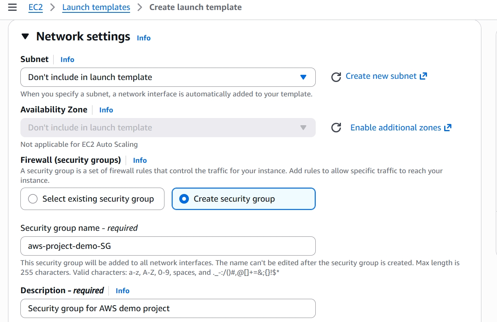

   Make sure the following ports are allowed in SG inbound rules:  
   (1). SSH port 22  
   (2). TCP port 8000  
   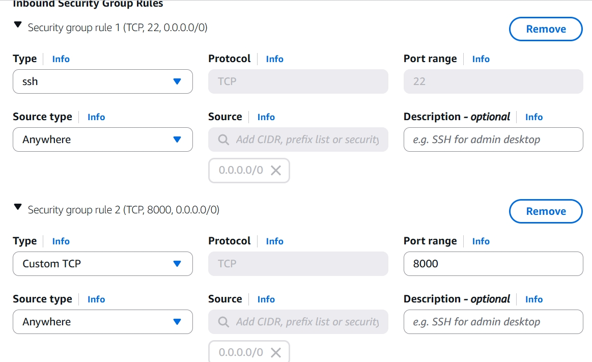

   After creatation of ASG, you should see the two available EC2 instances now.

3. **Create a Bastion EC2 Host.**  
   
   Now your servers are ready, you need to put your applications on them. But you can't access them directly, because they are in private subnets.  
   Therefore you need to create a bastion host.  
   Create an EC2 (your bastion host) in public subnet. Then ssh to this bastion EC2, and ssh to the private EC2 on your bastion EC2.  
   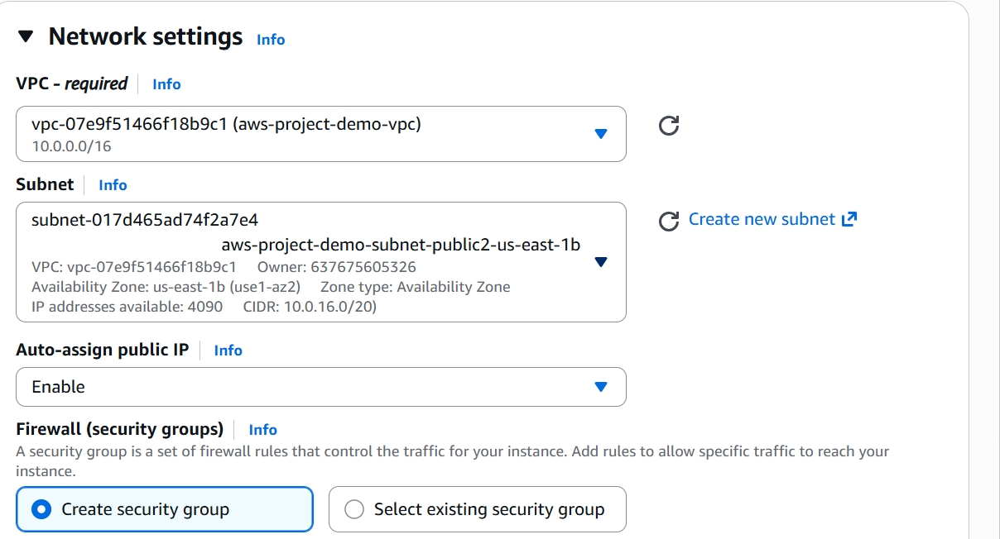
   

4. **Login EC2 by Bastion Host**:  

   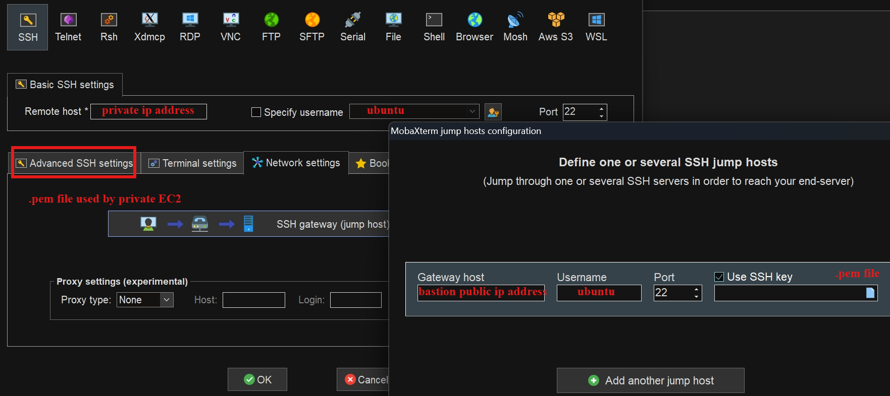  

   After login private EC2 server, add python application on this EC2 server:  
   vim index.html  
   Press 'i': insert mode  
   Use example html codes: https://www.w3schools.com/html/html_basic.asp:  

   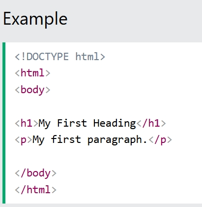  

   After insertion, do 'Esc'  
   Enter ':wq' to save and quit    
   Then do: python3 -m http.server 8000  
   Now your python application on first subnet is ready to use.
   
5. **Create Load Balancer.**  
   
   In EC2, choose load balancer  

   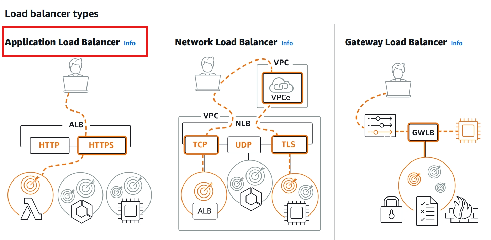

   LB basic configs:  

   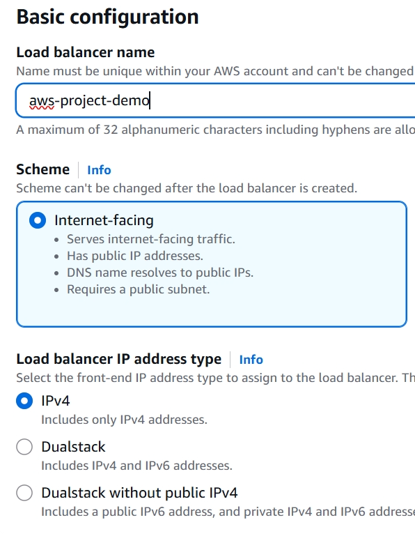

   Set up which VPC to use and which public subnet to use:  
   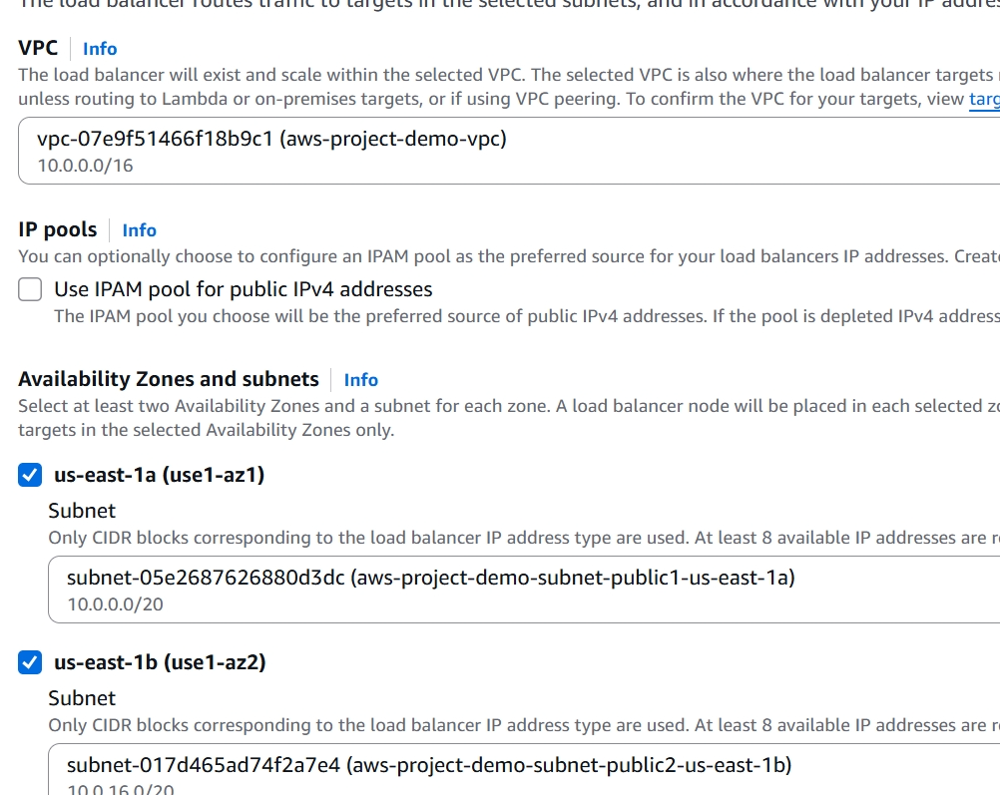

   Set up this ALB's SG:  
   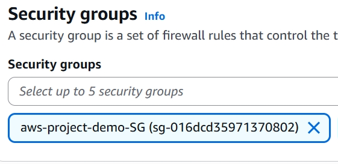

6. **Create Target Group.**  
   
    Target group instance, port 8000 (should match with your python application), include the 2 private EC2 instances created by the ASG.  

    Turn on listener:  
    Go to Security on the right, add new inbound rule: HTTP 80 All ipv4
    Reason: 使用ALB-DNS name访问时，如果不带后缀，浏览器默认的访问端口为80，此时ALB使用的SG只包含了ssh port22 + TCP port8000，所以会unreachable；如果使用了ALB-DNS:8000，理论是可以直接访问的  
    
    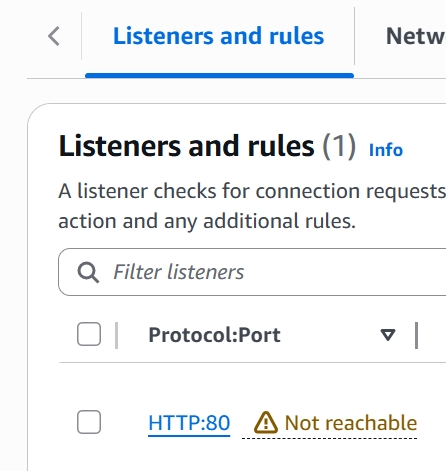

7. **Final Test.**  
   
   Enter this DNS name into your browser:  

   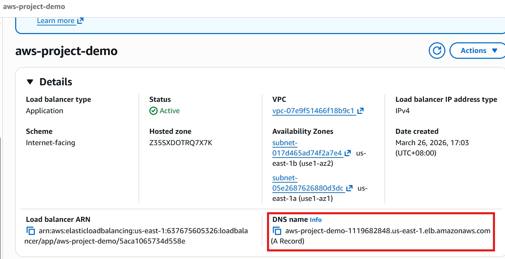  

   You should see the following:  

   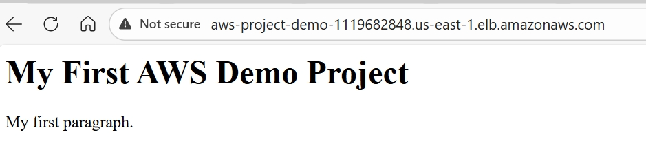  

   And check Target group page, should be like this:  

   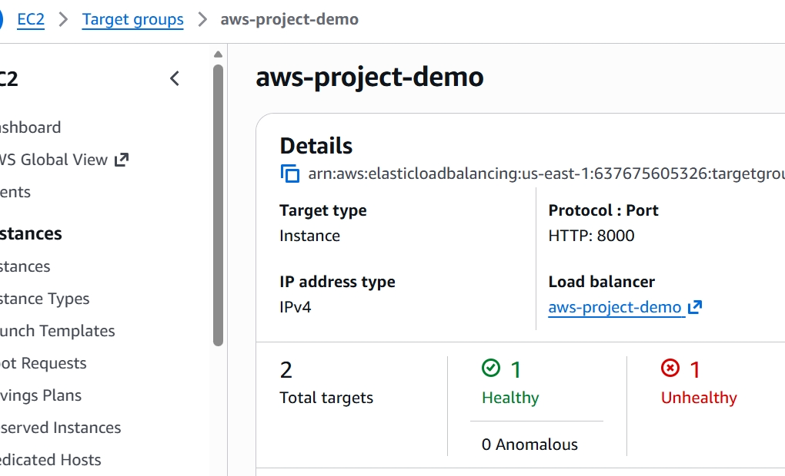  

   Because we only set up applications on 1 EC2 server, so another EC2 server will not be able to receive traffic. Then the health check will show 1 healthy and 1 unhealthy.  

   If we add applications on another EC2 server, the health check will show 2 healthy.

8. **Delete Resources After Test**  
   
   测试结束后删除service防止过度计费：  
   Delete Auto Scaling Group first (in EC2), otherwise even if you delete those 2 private subnet EC2, ASG will automatically create them again.  
   Delete Load balancer (in EC2).  
   Delete Target groups (tho usually very tiny fees, in EC2).  
   Terminate bastion host (the EC2 created manually).  
   Delete Nat Gateways in VPC.  
   Release Elastic IP address in EC2 (It can only be deleted when its' associated id / instance id/ network interface is none. Delete Nat gateway may take a couple of minutes).

9.  **Some Key Takeaways.**  
    
    (1). 网页浏览流量流通路径:  
    internet -> VPC Internet gateway -> Load balancer(会对用户使用的ip address + port进行翻译转换) -(based on Target group's rules)> private subnet EC2EC2 in private subnet(EC2看见的都是ALB private ip address，用户真实ip被包在在ALB发来的http headers里)  
    管理员登陆路径:  
    your laptop -> VPC IGW -> bastion host -> private subnet EC2

    (2). ALB 的代理(Proxy)机制：  
    IP 转换： ALB 会将数据包的 Source IP 替换为 ALB 自己的 Private IP。EC2 只能直接看到 ALB，真实用户 IP 被封装在 HTTP Header (X-Forwarded-For) 中  
    端口映射： ALB 会根据 Target Group 的配置 将流量准确转发到指定的后端端口（如 8000），而不是随机分配。这实现了“外网 80 对应内网 8000”的灵活转换。  

    (3). SG不仅可以作用于EC2，也可以作用于ALB，所以当用户在浏览器尝试通过port8000来访问网页时，必须确保ALB打开了port8000，不然发出去的流量会被block在ALB之外
    
    
    对于private EC2的SG配置：最好source ip只配置ALB的SG id (sg-xxxxx) (不直接配置ALB private ip原因：随着流量增大，ALB ip可能会变，但sg id永远不变)
    实际操作:  
    ALB 绑定了一个SG，ID: sg-1111，想让 Private EC2 只接收来自这个 ALB 的 8000 端口流量  
    配置 EC2 的安全组入站规则：TypePort RangeSource (来源) CustomTCP   8000  sg-1111 
    
