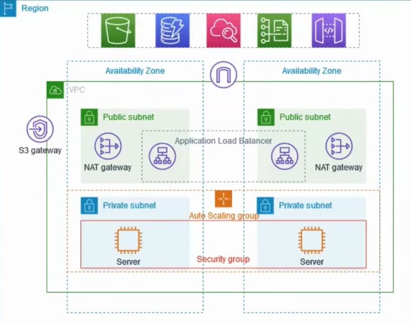

# VPC Project

This project is going to set up a VPC which has 2 availability zones, each with 1 public subnet and 1 private subnet (that would be 4 subnet in total). The VPC will also have a bastion host, a NAT gateway, and a load balancer. ASG will be used to automatically launch EC2 instances in the private subnets.  The EC2 instance in the first private subnet will be a web which is reachable from your browser. The EC2 instance in the second private will be set up with nothing, and its SG will not be open. In the final test, you should only be able to access 1 web and unreachable to another.  

The whole structure is shown below:  
  

Some concepts before diving into the project:  
Region: 地理位置，如Tokyo, Singpore.  
AZ: 同一个region内一般有多个AZ，如ap-northeast-1a, ap-northeast-1b.  

1. **Create VPC.**  
2. **Create ASG.**  
3. **Create a Bastion EC2 Host.**  
4. **Create Load Balancer.**  
5. **Create Target Group.**  
6. **Final Test.**  
7. **Some key takeaways.**